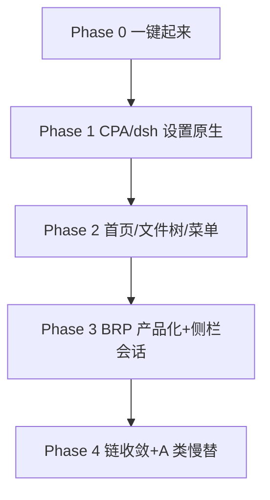

# dsh / CPA / BRP 迁入浏览器 — 盘点与施工计划

> 状态：**Phase 0 完成**（2026-09-18；0.6 自动化面过，UI 点击/扩展重连开放）→ 下一步 Phase 1
> 范围：把主线 `kokoa` 的 dsh 运行时、CPA、BRP 能力迁到以本仓为底座的产品链（C 链）
> 关联：`remaining-to-done.md` · `acceptance-2026-09-18-phase0.md` · 主线 `docs/dsh-frontend-migration.md` · 主线 `docs/launch-paths.md`

---

## 0. 前提决策（已确认）

| # | 决策 | 内容 |
|---|---|---|
| D1 | 产品形态 | **C 链**：本仓出 zip + 主线 overlay/`sidecar` 运行时；**不**把 Node 塞进 Gecko 进程 |
| D2 | 「迁进浏览器」含义 | **UI/入口原生化**（设置、首页、状态）+ **启动器负责拉起运行时**；sidecar/CPA/BRP 仍是独立进程 |
| D3 | 作废 | `overnight-sprint.md`「不做旧外壳功能迁移」——与本次目标相反，明确作废 |
| D4 | 启动链 | **只保留 C**；A/B 降级为调试；dsh 端口产品默认 **3081**（避开用户日常 3080） |

**产品判据（主线已拍板）**：能力留在 3080 页里 = 等于没做。

---

## 1. 功能盘点

### 1.1 【已在本仓】— 不必重做

| 能力 | 证据 |
|---|---|
| 拉起 dsh + stdout 抓 token | `src/zen/kokoa/KokoaDshSidecar.mjs` |
| AI 标签复用 / 多会话 fragment | `src/zen/kokoa/KokoaAiPanel.mjs` |
| 与网页原生分屏 | `src/zen/kokoa/KokoaAiSplit.mjs` |
| 会话列表 HTTP RPC | `src/zen/kokoa/KokoaDshSessions.mjs` |
| space↔session 绑定 | `src/zen/kokoa/KokoaWorkspaceSessions.mjs` |
| 设置分类骨架 + 菜单 pref | `kokoa-settings.js` / `KokoaMenubar.mjs` |
| 单测 + 产物核对 | `scripts/check-artifact.py` · `src/zen/kokoa/*.test.js` |

### 1.2 【仅在主线】— 迁移主体

| # | 能力 | 主线入口 | 优先级 |
|---|---|---|---|
| 1 | **8318 状态桥**（health/cpa/brp/dsh-settings/fs/status） | `apps/sidecar/src/bridge.ts` | **P0** |
| 2 | **sidecar 生命周期**（parent-pipe、CPA 托管） | `apps/sidecar/src/index.ts` | **P0** |
| 3 | **CPA 全链**（bin + config + lifecycle + 设置页区） | `cpa-config.ts` / `cpa-lifecycle.ts` / `kokoa.mjs` | **P0** |
| 4 | **dsh 设置直写** `settings.yaml` | `dsh-settings.ts` + `/kokoa/dsh/settings` | **P0** |
| 5 | **BRP 接入**（lockfile 发现 + MCP 守卫） | `brp-client.ts` + `packages/browser-firefox-mcp` | **P0** |
| 5b | **产品 dsh-home BRP MCP 注入**（cordis `dsh-mcp-client`，非 profile.json） | `ensure-dsh-cpa-provider.ps1` | **P0** ✅ |
| 6 | **dsh 插件五件套** + junction 注册链 | `packages/dsh-plugin-*` + `integrate-browser.ps1` | **P1** |
| 7 | **about:kokoa 首页 / 文件树 / 会话历史** | `home.js` / `sessions.*` / `fs-list` | **P1** |
| 8 | **启动器**（token 抓取+校验） | `scripts/start-kokoa.ps1` | **P1** |
| 9 | 消息网关 / 技能 UI / 记忆可视化 | `message-gateway` 等 | **P2** |

### 1.3 【两边都没有】

- dsh 会话**外部切换**通道（产品边界，需上游 deep-link）
- 统一产品启动链（三链未收敛 — 本计划负责收敛到 C）
- BRP 扩展侧 `tab.setControllable`
- 应用图标美术

### 1.4 【明确不要搬】

force 布局、悬浮面板、硬编码 token、会话切换遥控、Playwright、把「能力留在 3080 页」当完成。

---

## 2. BRP 连不上 — 根因（2026-09-18 本机实测）

| # | 证据 | 结论 | 置信度 |
|---|---|---|---|
| 1 | `%LOCALAPPDATA%\brp-bridge\bridge.lock` **不存在**；无 brp-bridge 进程 | **Bridge 没在跑** → 一律 `no-lockfile` | 高 |
| 2 | `http://127.0.0.1:8318/kokoa/health` **超时** | **sidecar 没在跑** → 面板读不到 BRP/CPA | 高 |
| 3 | `.kokoa-state/bin/brp-bridge.exe` **在**（v1.0.1） | 二进制齐，缺**启动编排** | 高 |
| 4 | Firefox 扩展 `brp-bridge@brp-spec.org.xpi` **已装** | 扩展侧就绪 | 高 |
| 5 | `mcp/brp.json` 仍是 `python3` + `BRP_WS_ADDR=9817` | Windows Store 别名 exit 49；硬编码 9817 与 lockfile 随机端口模型冲突 | 高 |
| 6 | 扩展缺 `tab.setControllable`（文档） | 用户标签截图 `-32003`，需人工授权 | 中 |
| 7 | 真机「brp 未连接」vs headless `brp=true` | 启动早期竞态 + 旧产物 + 双 CPA 状态源 | 中 |

**一句话**：协议没坏，是 **「谁把 bridge + sidecar 拉起来并写进启动链」没人管**；叠加 `brp.json` 旧配置和双 CPA 状态源。

---

## 3. 施工计划

### Phase 0 — 止血：一键起来（1–2 天）✅ 已完成（2026-09-18）

**目标**：一条命令 → sidecar + dsh + brp-bridge + 浏览器，状态全绿。

| 步骤 | 做什么 | 验收 | 状态（2026-09-18 复核） |
|---|---|---|---|
| 0.1 | `start-kokoa.ps1`：起 dsh 前 **起 `brp-bridge.exe`**（写 lockfile），退出收尸 | lockfile 出现且 pid 活 | ✅ 实测 lock pid 活、9817 通 |
| 0.2 | 同脚本起 **sidecar**（`apps/sidecar/dist`），等 `/kokoa/health` | 8318 200 | ✅ health 200 |
| 0.3 | 修 `brp.json`：`sys.executable` 绝对路径；**9817 仅作无 lockfile 回退**（实现保留回退，与原文「去掉写死」略偏，可接受） | dsh MCP 能拉 adapter | ✅ 绝对路径已落；回退保留 |
| 0.4 | CPA 状态源统一到 sidecar `/kokoa/cpa/status` | 不再「状态读取失败」双源矛盾 | ✅ 消费方全指 8318；旧双源控制条已删（`b92da05`） |
| 0.5 | 启动日志：`sidecar_ready` / `brp_lock` / `cpa_bin` / `dsh_token` | 失败可定位 | ✅ `KOKOA-STARTUP.txt`；复测 `dsh_token=ok validate=http-ok` |
| 0.6 | 真机跑 `manual-test-checklist` | 401 / 分屏 / 设置 / BRP | 🟡 **自动化面已过**（见 acceptance）；纯 UI 点击 + 扩展重连仍开放 |
| 0.7 | **产品 dsh-home 注入 BRP MCP**（`dsh-mcp-client` → cordis.patch.yml） | AI 能调 `mcp__brp__*` | ✅ `ensure-dsh-cpa-provider.ps1` 幂等注入；Config schema 校验过 |

**复测证据（2026-09-18 21:27，`-NoLaunch`）**：
`brp_lock=ok pid=7980` · `sidecar_ready=true` · `dsh_token=ok validate=http-ok` ·
CPA `managed:true running:true` · 端口 3081/8318/9817/28317 均 LISTENING。

**不做**：新功能、A 类大搬迁。

**文档勘误**：`docs/browser.md` / `browser-firefox-mcp/README.md` 旧文
「brp.json 合并进 dsh profile（bootstrap 已处理）」**不实**——dsh 不读
`profile.json`/`brp.json`；真实面是 cordis.patch.yml + dsh-mcp-client（已改文档）。

### Phase 1 — CPA + dsh 设置进浏览器（3–5 天）★ 当前

| 步骤 | 做什么 | 源 |
|---|---|---|
| 1.1 | 主线 `kokoa.mjs` CPA 区迁到本仓源码，`NetUtil`→8318 | 主线 F1 已验证 |
| 1.2 | 迁 `/kokoa/dsh/settings` 白名单 UI | `dsh-settings.ts` |
| 1.3 | 设置页补：dsh 状态、打开工作区、AI 分屏、并行会话上限 | 主线 pane + 本仓骨架合并 |
| 1.4 | `ensure-dsh-cpa-provider` 并入启动器；CPA `managed:true`（避免 PUT 409）；**同脚本注入 BRP MCP** | 已有脚本 + 0.7 |
| 1.5 | dsh 侧 CPA 卡片保持只读+跳转 | 已收口 |
| 1.6 | 契约测试：设置控件 ↔ sidecar 路由 ↔ pref | 对齐 `test-native-settings-*` |

**验收**：不打开 3080 设置，也能配 CPA 上游、改 dsh 主题/语言；保存即生效。

### Phase 2 — 门面与首页（3–5 天）

| 步骤 | 做什么 |
|---|---|
| 2.1 | `about:kokoa`（工作区/状态/文件树/快捷入口）迁入本仓或经 overlay 稳定注入 |
| 2.2 | `kokoa.startup.homeFirst=true` 产品默认；**M4 门面切换放最后** |
| 2.3 | 会话历史页迁入 |
| 2.4 | 文件树：优先 sidecar `/kokoa/fs/list` |
| 2.5 | 二级菜单显隐可配置（realtime #5） |

### Phase 3 — BRP 产品化 + AI 闭环（1 周）

| 步骤 | 做什么 |
|---|---|
| 3.1 | 设置页「浏览器控制」：BRP 状态 / 截图 / 允许操控 |
| 3.2 | 启动自检：无 lockfile → 一键拉起（**已在 0.1**）；扩展未装 → 引导 |
| 3.3 | `setControllable` 缺口：UI 明示；AI `tab.open` 路径保持可用 |
| 3.4 | 侧栏第 2/3 步：接 `KokoaDshSessions` 会话列表（不遥控切换） |
| 3.5 | 真机：navigate/snapshot/screenshot + 人工接管 |

### Phase 4 — 收敛与慢替（持续）

- 启动链只留 C；A/B 标 deprecated  
- A 类 19 包按「先跑起来、有现成先用」慢慢搬  
- 消息网关、记忆可视化 → P2  
- 更新本仓 `remaining-to-done` / README 与主线进度文档  

---

## 4. 里程碑

| 里程碑 | 判据 |
|---|---|
| **M0** | 真机：无 401、8318 绿、lockfile 在、CPA 单一状态源、**dsh 已挂 brp MCP** |
| **M1** | 设置页可完整管理 CPA + dsh 设置，不进 3080 |
| **M2** | 首屏 = about:kokoa；文件树可用 |
| **M3** | BRP 端到端 + 侧栏会话列表 |
| **M4** | 单启动链 + 文档与实物一致 |

---

## 5. 风险

| 风险 | 缓解 |
|---|---|
| 3 小时 CI 才能验 UI | Phase 0/1 优先 sidecar 单测 + 本地 `build.py`；CI 只卡里程碑 |
| 用户跑旧产物 | 启动器打印 `omni.ja` 时间戳；不匹配则警告/拒绝 |
| 双底座 155 vs 156 | 只验 C / Zen 156 |
| CPA `managed:false` → 409 | 启动器保证 lifecycle 注入 handlers |
| 扩展 `setControllable` 缺失 | 不自动放宽；按钮透出错误 |

---

## 6. 本周顺序

1. ~~**Phase 0.1–0.5**：启动编排 + `brp.json` + 状态源~~ ✅（+0.7 BRP MCP）  
2. ~~**真机**：`manual-test-checklist` 自动化面~~ ✅ `acceptance-2026-09-18-phase0.md`  
   （剩余：纯 UI 点击 + BRP 扩展重连 — 不挡 Phase 1）  
3. **→ Phase 1**：CPA 设置迁入本仓源码（`kokoa.mjs` → 本仓 `kokoa-settings.js`）  
4. ~~**并行**：更新 `remaining-to-done` / README~~ ✅ 2026-09-18 已刷  

---

## 7. 复核记录（2026-09-18）

| 项 | 结论 |
|---|---|
| 两仓提交 | 主线 `42e616c`、本仓 `65ad421`（各 ahead **3**，未 push；含此前 `8da8229`/`fd95bcb` 等） |
| 运行时「全绿」 | 曾是瞬时快照；**复测与 GUI 启动后再次全绿**；`mcp-brp` 子进程在 |
| `dsh_token=missing` 矛盾 | 旧证据；复测 `ok validate=http-ok` |
| 产品无 `mcpServers.brp` | dsh 不读 profile.json/brp.json → cordis **insert** + `dsh-mcp-client`（0.7）；顶层 `- id:` 不加载（实测） |
| Phase 0.4 | 消费方全指 8318；旧双源 UI 已删 → 完成 |
| Phase 0.6 | 自动化判据全过；UI 点击项见 acceptance §五 |
| 僵尸 lock | `Get-BrpLock` 对 pid 死返回 null 并重启 |  
